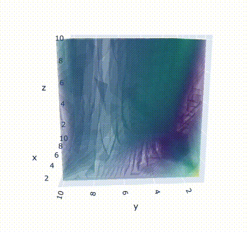

# ShaFT: Shape Fourier Transform

This package implements the proper discrete shape fourier transform.

## Some motivation
The Discrete Fourier Transforms is used everywhere. However, any attempts to compute the DFT of a 2d or 3d shape would yield false results. This is because to apply the classical DFT to a shape, the shape needs to be represented as a signal. That is, as its indicator function. As we know, the DFT does not respond well to such "jumpy" functions and yields a smeared out version of the shape instead of the transform.
Instead, we propose to compute the FT as the sum of the FT of the discrete part of the shape (i.e triangles and tetrahedras). This is what we call the Shape Fourier Transform.
An accompanying paper is coming soon.

## Usage 

To compute the Shape FT of surfaces simply:
```python
import pyvista as pv # We use pyvista for loading and visualisation
from shaft import sft

<<<<<<< HEAD
k_range = 20 # The range to build the Z3 lattice sampling.
surface = pv.read('\path\to\mesh.vtk') # A triangulated surface.
fourier_coefs = sft(surface, k_range) # The fourier coefficients.
```
And for curves: 
```python
import numpy as np # 2d curves are defined as an array of 2 coordinates
from shaft import cft

k_range = 20 # The range to build the Z2 lattice sampling.
curve = np.load('\path\to\curve.npy') # 2d points defining the curve.
fourier_coefs = cft(curve, k_range) # The fourier coefficients.
```

>[!NOTE]
>To run the examples, you need to run both the *curve_classification/preprocessing.py* and *surface_classification/compute_coefs.py* first.


  

This cheburashka example script is in examples/basics/cheburashka.py
## Installation

To install just follow the standard procedure 
```
git clone https://github.com/djoharr/shaft
cd shaft
pip install .
```

or for editable install: 
```
pip install -e .
```

## License

This implementation is licensed under the MIT License, see [LICENSE](LICENSE) for details.
